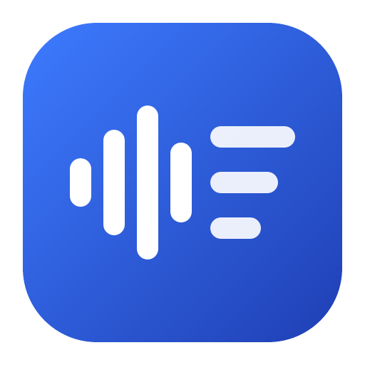
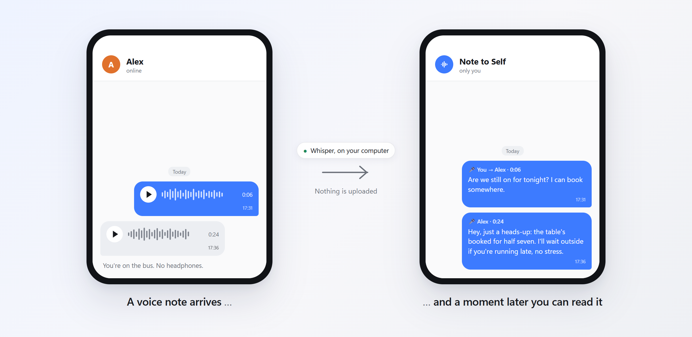
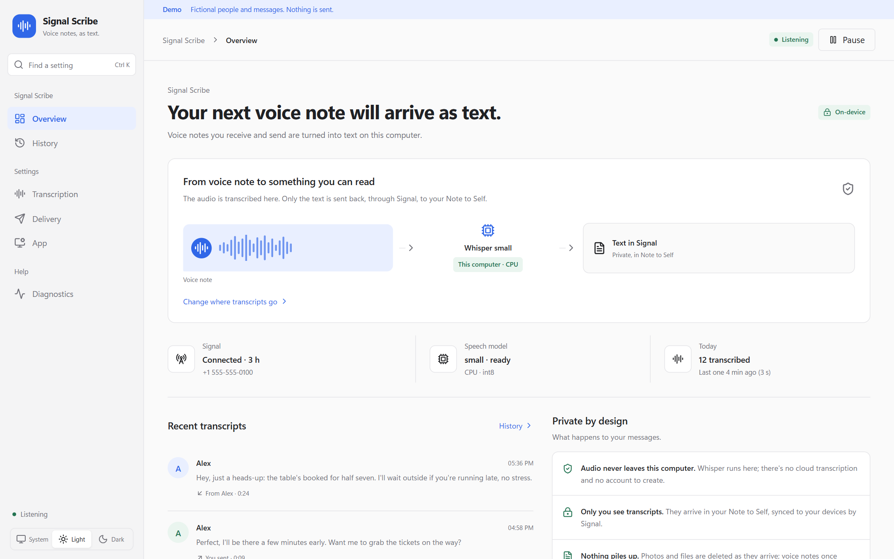
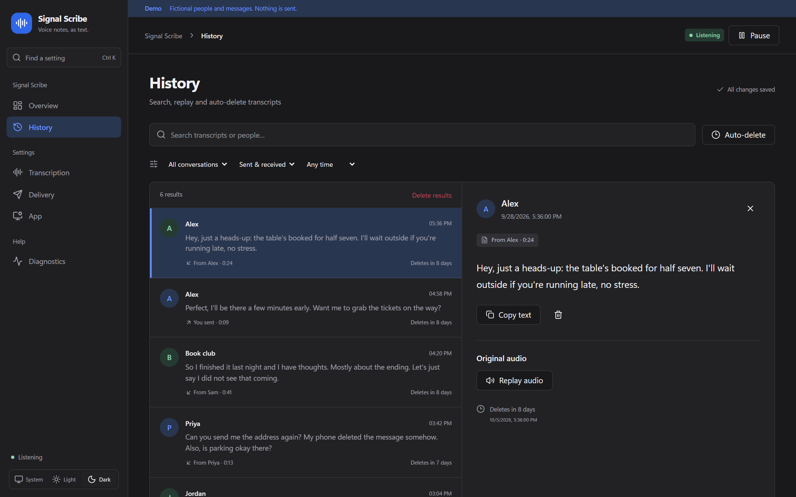
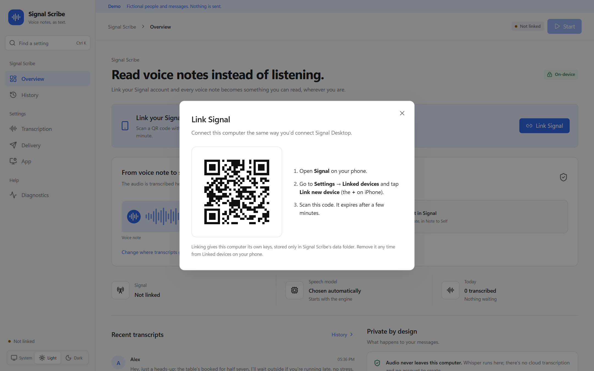
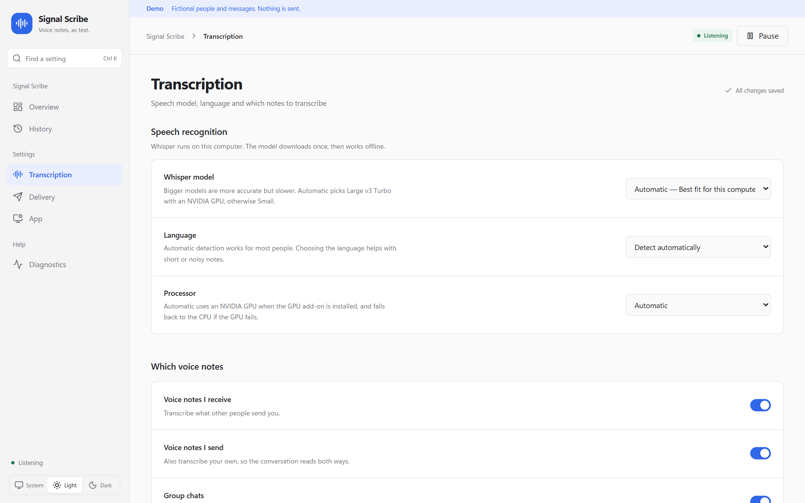

<p align="center">
  
</p>

<h1 align="center">Signal Scribe</h1>

<p align="center">
  <strong>Read your Signal voice notes instead of listening to them.</strong><br>
  Transcribed on your own computer. Nothing is uploaded anywhere.
</p>

<p align="center">
  <a href="https://github.com/JakeTheRabbit/signal-voice-scribe/releases/latest"></a>
  <a href="https://github.com/JakeTheRabbit/signal-voice-scribe/actions/workflows/ci.yml"></a>
  <a href="https://github.com/JakeTheRabbit/signal-voice-scribe/actions/workflows/install.yml"></a>
  <a href="LICENSE"></a>
</p>



## The problem

Some people only send voice notes. That's fine until you're on the bus, in a meeting, at the
dinner table or anywhere else you can't play a recording out loud, or wouldn't want to, because
you don't know what's in it. The conversation stalls until you can listen.

Signal Scribe fixes that. It links to your Signal account as a desktop device (the same way
Signal Desktop does) and turns every voice note into text:

- **What they say:** voice notes you receive are transcribed, so you can read them anywhere.
- **What you say:** your own voice notes are transcribed too, so the conversation reads both ways.
- **On your phone, in seconds:** the text arrives in your private **Note to Self** chat in Signal,
  with a notification, so you read it and reply without ever pressing play.

It's **completely self-hosted**. The speech recognition ([Whisper](https://github.com/openai/whisper))
runs on your own computer. There's no cloud service, no account, no API key and no subscription.
Your audio never leaves the machine; only the resulting text goes back to you, end-to-end
encrypted, through Signal.

## Screenshots

| | |
|---|---|
|  |  |
| **Overview.** What's happening right now, and where your transcripts go. | **History** (optional). Search, copy or replay later, with auto-delete. |
|  |  |
| **Linking.** Scan a QR code with your phone, like Signal Desktop. | **Settings.** Model, language, and which voice notes to transcribe. |

All screenshots use the built-in demo with fictional people. More: [delivery](docs/images/delivery-dark.png) · [diagnostics](docs/images/diagnostics-light.png) · [dark overview](docs/images/overview-dark.png).

## Features

- Transcribes voice notes you **receive and send**, in one-to-one and group chats (each can be turned off).
- Transcripts go to your **Note to Self** (only you see them) or, if you prefer, as a **reply to the
  voice note in the same chat** so everyone gets a text version.
- **About 100 languages**, detected automatically, or pick yours.
- Fast on an ordinary computer: an 8-second voice note takes about 3 seconds on a recent CPU, and
  under half a second on an NVIDIA GPU, which is used automatically when available.
- **Never loses a voice note.** Notes are queued on disk first, so sleep, restarts and crashes just
  delay a transcript. Repeats never produce duplicates.
- **Keeps nothing it doesn't need.** Photos, videos and files are deleted the moment they arrive;
  voice notes once transcribed. History is off unless you turn it on, and it never outlives a
  disappearing message.
- Desktop app for **Windows, macOS and Linux** that lives in the tray/menu bar and starts at login,
  plus a **headless mode and Docker image** for a home server or NAS.

## Install

You need a computer that's usually on: a desktop, laptop or small server. It's where the
transcribing happens. Your phone only needs Signal.

| | Supported |
|---|---|
| Windows | 10 and 11, 64-bit (x64) |
| macOS | 11 Big Sur or later, Apple silicon or Intel |
| Linux | 64-bit x86-64 desktops and servers (ARM needs [extra steps](docs/install.md#arm-linux)) |
| Disk space | about 1.5 GB, plus the speech model (0.5–1.6 GB) |

The installer downloads everything it needs into its own folder: Python, Java, [signal-cli](https://github.com/AsamK/signal-cli)
and the Whisper model, checking each download against a known checksum. It doesn't need admin
rights and doesn't touch anything else on your system.

### Windows

1. Download the latest release's **Source code (zip)** from the
   [Releases page](https://github.com/JakeTheRabbit/signal-voice-scribe/releases/latest) and unzip it
   somewhere permanent, for example your user folder. (Or `git clone` this repository.)
2. Open the folder, click the address bar, type `powershell` and press Enter. Then run:

   ```powershell
   powershell -ExecutionPolicy Bypass -File .\install.ps1
   ```
3. Signal Scribe opens when it's done (about 5 minutes). Continue with [Link your phone](#link-your-phone).

### macOS and Linux

```bash
git clone https://github.com/JakeTheRabbit/signal-voice-scribe.git
cd signal-voice-scribe
./install.sh
```

macOS puts **Signal Scribe** in the Applications folder inside your home folder; Linux adds it to
your app menu. On
GNOME, the tray icon needs the AppIndicator extension (`gnome-shell-extension-appindicator`).

### Home server or NAS (headless)

No window, just the engine, on an x86-64 machine. See **[docs/headless.md](docs/headless.md)** for
Docker Compose, systemd and the command line. In short:

```bash
docker compose run --rm signal-scribe link   # shows a QR code in the terminal
docker compose up -d
```

More detail, options (GPU on/off, model choice, no autostart) and updating:
**[docs/install.md](docs/install.md)**.

## Link your phone

1. In Signal Scribe, click **Link Signal**. A QR code appears.
2. On your phone, open **Signal → Settings → Linked devices → Link new device** (the **+** on iPhone)
   and scan it.
3. Click **Start transcribing**. That's it: send yourself a voice note to try it.

Signal Scribe shows up in your phone's Linked devices list, next to Signal Desktop if you use it.
You can remove it there at any time.

## What you'll see

A voice note from Alex turns into this message in your Note to Self:

```text
🎤 Alex · 0:24
Hey, just a heads-up: the table's booked for half seven. I'll wait outside if you're
running late, no stress.
```

Your own voice notes read `🎤 You → Alex`, group notes say `in Book club`, and a note transcribed
long after it arrived (say, because the computer was asleep) shows when it was sent. If a note
can't be transcribed (too long, or unreadable) you get a short private notice instead of silence.

## Privacy

| | Where it happens | What leaves the computer |
|---|---|---|
| Receiving messages | signal-cli, as a linked device | Nothing new: this is Signal's normal encrypted traffic |
| Transcribing | Whisper, on this computer | **Nothing** |
| Delivering the text | Signal | The transcript, end-to-end encrypted, to your Note to Self (or the chat, if you choose) |
| Speech model | Downloaded once from Hugging Face | An anonymous download; afterwards it loads offline |

Things to know:

- **A linked device can read your messages.** That's how Signal Desktop works too. Signal Scribe's
  data folder holds this computer's Signal keys, so protect the computer (login password, disk
  encryption) as you would any device signed in to your Signal.
- **Stored on disk:** the Signal keys (`data/`), settings, and, only if you turn on history,
  transcripts and optionally their audio, deleted automatically after the period you choose.
- **Not stored:** photos, videos and other attachments (deleted as they arrive), voice notes after
  they're transcribed, and message text in logs.
- **Disappearing messages:** a Note to Self transcript doesn't disappear with the original unless
  you also turn on disappearing messages for Note to Self in Signal.

Full details: [PRIVACY.md](PRIVACY.md) · Security reports: [SECURITY.md](SECURITY.md)

## FAQ

**Does my computer have to be on?** Voice notes are transcribed while it's on and online. Anything
that arrives while it's off is transcribed when it's back (Signal holds messages for linked devices
for a while). Signal unlinks devices that stay offline for about 30 days.

**Will the other person know?** No, unless you choose to post transcripts in the chat. Signal Scribe
never replies on your behalf.

**Does it work with Signal Desktop, or on a second computer?** Yes. It's just another linked device;
Signal allows several. Run one copy of Signal Scribe per account.

**How accurate is it?** As good as Whisper, which is very good for clear speech in major languages.
Larger models are more accurate but slower; the app picks one for your hardware and you can change it.

**Can I run it on my phone?** No. Phones don't allow the always-on background work this needs.
Your phone is where you read the results.

**Is this an official Signal app?** No. See the note below.

More in [docs/troubleshooting.md](docs/troubleshooting.md).

## Uninstall

Run `uninstall.ps1` (Windows) or `./uninstall.sh` (macOS/Linux). Add `-Purge` / `--purge` to also
delete your Signal keys, settings, history and the downloaded model, then delete the folder. Also
remove **Signal Scribe** from **Linked devices** on your phone.

## How it works

```text
 your phone ── Signal ──► signal-cli (linked device) ──► voice note queued on disk
                                                              │
                                   Whisper on this computer ◄─┘
                                              │
 your phone ◄── Signal ◄── text to Note to Self (or a reply in the chat)
```

The desktop app is a [Tauri](https://tauri.app) window and tray icon. It supervises a Python engine
that runs signal-cli in JSON-RPC mode and transcribes with
[faster-whisper](https://github.com/SYSTRAN/faster-whisper). Details, file layout and the design
decisions behind the reliability features: [docs/how-it-works.md](docs/how-it-works.md).

## Contributing

Bug reports and pull requests are welcome; see [CONTRIBUTING.md](CONTRIBUTING.md) and
[docs/development.md](docs/development.md). Please never include transcripts, phone numbers or QR
codes in issues.

## Licence and credits

Signal Scribe is released under the [MIT licence](LICENSE).

It stands on the shoulders of [signal-cli](https://github.com/AsamK/signal-cli) (GPL-3.0, downloaded
by the installer from its official releases and run as a separate program),
[faster-whisper](https://github.com/SYSTRAN/faster-whisper) and
[CTranslate2](https://github.com/OpenNMT/CTranslate2) (MIT), OpenAI's
[Whisper](https://github.com/openai/whisper) models (MIT), [Eclipse Temurin](https://adoptium.net)
Java (GPL-2.0 with Classpath Exception), [uv](https://github.com/astral-sh/uv) and
[Tauri](https://tauri.app).

> [!NOTE]
> Signal Scribe is an independent project. It is not affiliated with, endorsed by or supported by
> Signal Messenger LLC or the Signal Technology Foundation. "Signal" is their trademark. Signal
> Scribe relies on signal-cli, an unofficial client, and could stop working if Signal changes its
> service.
